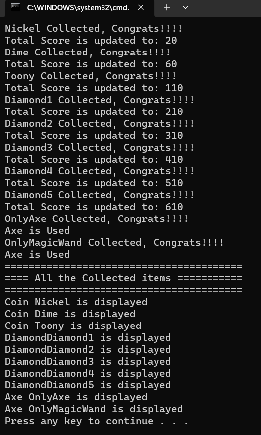

# Lab 3: More on Inheritance and Polymorphism
In this lab you'll take what you learned about Inheritance and Polymorphism one step further to create a more sophaticated structure.

Please complete what's missing in the starter code according to the following class diagram.

I suggest that you comment out all the lines with errors and uncomment them as you go step-by-step.

## Expected Output
